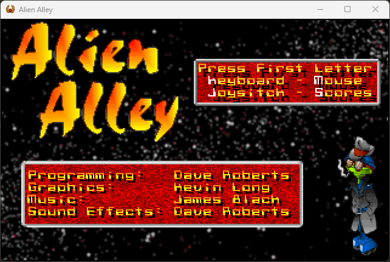
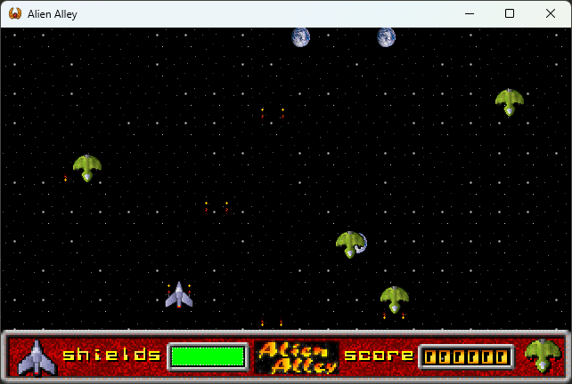

# What is this?

This is a [QB64-PE](https://github.com/QB64-Phoenix-Edition/QB64pe) conversion of the Alien Alley game that came with the book [PC Game Programming Explorer](http://www.droberts.com/pcgpex/pcgpex.htm) by Dave Roberts.

Yes, I converted the code again! This time from [FreeBASIC](https://github.com/freebasic/fbc) to [QB64-PE](https://github.com/QB64-Phoenix-Edition/QB64pe).

My FreeBASIC port can be found [here](https://github.com/a740g/AlienAlleyQB64/tree/648fe7202157055c1658c12fbf476dcc5c445fcb).

The original [Turbo C](https://winworldpc.com/product/turbo-c/3x) code that came with the book can be found [here](http://www.droberts.com/pcgpex/source.zip). The update for the [Turbo C](https://winworldpc.com/product/turbo-c/3x) code can be found [here](http://www.droberts.com/pcgpex/update.zip).

This conversion has multiple improvements over the FreeBASIC version. These are:

- Works natively on Windows, Linux & macOS
- There are no [Allegro](https://github.com/liballeg/allegro5) dependencies unlike the [FreeBASIC version](https://github.com/a740g/AlienAlleyQB64/tree/648fe7202157055c1658c12fbf476dcc5c445fcb)
- Uses native [QB64-PE](https://github.com/QB64-Phoenix-Edition/QB64pe/releases) graphics and sound functions
- Runs in 32bpp graphics mode unlike the [FreeBASIC version](https://github.com/a740g/AlienAlleyQB64/tree/648fe7202157055c1658c12fbf476dcc5c445fcb) that ran at 8bpp
- Runs at 640x400 (16:10 aspect ratio) fullscreen with square pixels
- PCX loading is handled using PCX support in [QB64-PE](https://github.com/QB64-Phoenix-Edition/QB64pe/releases)
- PCX color key transparency is done on the BASIC side
- MIDI playback is handled using MIDI support in [QB64-PE](https://github.com/QB64-Phoenix-Edition/QB64pe/releases)
- Alt + Enter puts the game in window mode

The source port also uses new features introduced in [QB64-PE v3.3.0+](https://github.com/QB64-Phoenix-Edition/QB64pe/releases) and as such may not work correctly or reliably with older versions of QB64-PE or any version of QB64. You've been warned. Please don't nag me about backwards compatiblity.

Icon by [Good Stuff No Nonsense](https://iconarchive.com/artist/goodstuff-no-nonsense.html)

As usual, I do not accept responsibility for any effects, adverse or otherwise, that this code may have on you, your computer, your sanity, your dog, and anything else that you can think of. Use it at your own risk.

## Original Readme

### ALIEN ALLEY

Release 1.0
November 13, 1994

Alien Alley is a vertically scrolling, fast action video game. The player controls a defending spaceship, flying though the cosmos.  Advancing alien spaceships make difficult foes as they advance on the lone defender, firing plasma cannons at will. How long can the defender hold out until he is finally overrun? Only you can say...

### INSTALLATION

Alien Alley may be installed by simply unzipping all the files in the archive to a single directory.  Alien Alley includes sound drivers for the Advanced Gravis UltraSound and Sound Blaster compatibles. To install the UltraSound drivers, run the SETGUS.BAT batchfile by typing "setgus" at the DOS prompt. To install the Sound Blaster compatible drivers, run SETSB.BAT by typing "setsb". The UltraSound drivers require that you run UltraMID before running the game itself.  If UltraMID is not run, the UltraSound drivers will not load. UltraMID can be run easily using the "e.exe" utility that comes with your UltraSound software.

### ABOUT ALIEN ALLEY

Alien Alley was created as an example for the book PC Game Programming Explorer, by Dave Roberts. Alien Alley demonstrates many of the game programming concepts and techniques described in PC Game Programming Explorer, including joystick, mouse, and keyboard programming, fast page flipping animation, VGA palette effects, music and sound, and a scrolling background.

PC Game Programming Explorer includes all the source code used to create Alien Alley as well as the source code for many other projects developed in the book.

PC Game Programming Explorer, by Dave Roberts, is available for US$34.95 at a bookstore near you or directly from Coriolis Group Books.

The Coriolis Group
7339 East Acoma, Suite 7
Scottsdale, AZ 85260 USA
Phone: (800) 410-0192
       (602) 483-0192
FAX:   (602) 483-0193

### PC Game Programming Explorer CONTENTS

Part 1: Let the Games Begin

1. The Great Adventure
2. Mastering the Keyboard
3. Catching the Mouse
4. Joystick Magic

Part 2: The Graphics Adventure

1. VGA Basics
2. Bitmaps and Bitblts
3. Adventures in Animation
4. Color Your World

Part 3: Into the Action

1. Detecting Collisions
2. Controlling Game Speed
3. Creating Alien Alley

Part 4: Advanced Techniques

1. Audio Immersion
2. Scrolling Along

Game Programming Resources

### CREDITS

Programming: Dave Roberts  
Graphic Art: Kevin Long  
MIDI Music : James Black  
Sound FX   : Dave Roberts  

The artists involved with this project can be contacted at:

AIR Design - Kevin Long  
3354 N.E. 83rd Ave  
Portland, OR 97220 USA  
Voice Mail: 800-223-3737x594  
Email: air@netcom.com  

J. Black  
PO Box 11740  
Denver, CO 80211-0740 USA  
Email: jblack@csn.org  

Dave Roberts may be reached at The Coriolis Group.

### Sound Drivers

To keep the size of this archive down, Alien Alley is distributed with just two audio drivers.  Alien Alley uses audio drivers from The Audio Solution's DigPak and MidPak. If you own something other than an UltraSound or a Sound Blaster, chances are that DigPak/MidPak drivers exist for your sound card. To get all the audio drivers, call the BBS at 314-939-0200 and look for the DigPak/MidPak developers kit (DMKIT.ZIP) in the main file library.

DMKIT.ZIP also includes all the files necessary to develop an application around DigPak/MidPak. If you are a game developer, take a look at DIGPKAPI.DOC and MIDPKAPI.DOC.

### COPYRIGHTS

Alien Alley, Copyright 1994, David G. Roberts, All Rights Reserved

Original music, Copyright 1994, James J. Black, All Rights Reserved

Original artwork, Copyright 1994, Kevin Long

General MIDI patches (c) 1994 The Fat Man and K. Weston Phelan

### REDISTRIBUTION

Alien Alley may be, and is encouraged to be, redistributed throughout the world.  All files in the original archive MUST remain intact, however.  No files may be altered or removed. Under no circumstances may this program be sold for a fee.

In summary, make as many copies of this archive as you want as long as you: (1) keep all the files together, and (2) don't sell it.
